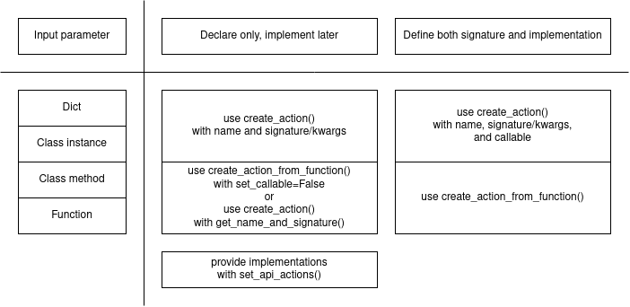

  The callable interface of `up_esb`
=========================================

Assuming you have fluents and actions definitions in your application domain,
there are various ways to create UP representations of them using the `up_esb`.
The best way depends on what format your input parameter has and whether you want
to associate the executable implementation of your callable at the same time
when you are creating its UP representation. If your fluents or actions can have
different implementations which you want to choose later, you need to call
the `up_esb` methods correctly to only declare a fluent or action.

The most general format for your input parameter is a `dict` describing its parameters
and return value. You can always use this option of `create_action()` by using the
`signature` parameter or `**kwargs`. Helper functions exist to simplify the call in
specific cases. All supported cases are listed in the table below.

## The `create_action()` interface

Hint: The helper functions `create_action_from_function()` and `get_name_and_signature()`
treat the defining class of a method as part of the action signature if you created
a UP type for that class using `create_types()`. In this case, the method's
defining class will implicitly be the first parameter of the UP action signature.

See [test_create_action.py](../tests/test_create_action.py) for examples.
